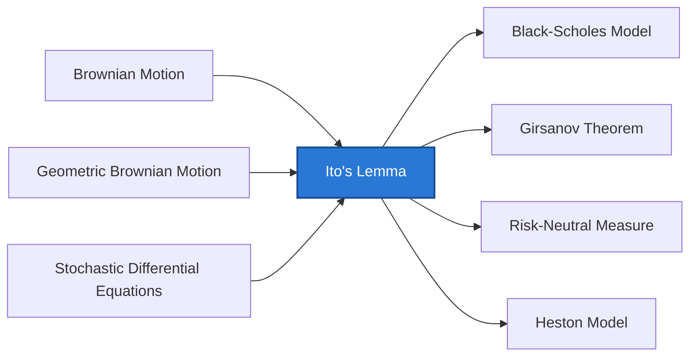

> [!info] Problem Chain
> **Chain:** Pricing → Gap 3: Ordinary calculus cannot operate on GBM paths
> **This concept:** Provides the corrected chain rule for functions of stochastic processes — the tool that makes all derivative pricing calculations possible.
> **Alternative approaches to this gap:** none — unique solution; Stratonovich calculus is an alternative convention but not an alternative to Ito in finance
> **You need first:** [[Brownian Motion]], [[Geometric Brownian Motion]], [[Stochastic Differential Equations]]
> **This unlocks:** [[Black-Scholes Model]], [[Girsanov Theorem]], [[Risk-Neutral Measure]], [[Heston Model]]



## Why This Exists

**The gap:** To derive how an option price changes as the underlying stock moves, practitioners needed to differentiate functions of GBM. But GBM paths are nowhere differentiable — they are infinitely jagged. Applying the ordinary chain rule gives the wrong answer, because it ignores the contribution of the path's roughness.

**What came before:** The ordinary chain rule: $d(f(x)) = f'(x)\,dx$. This works perfectly for smooth, differentiable functions. For stochastic processes driven by Brownian motion, it fails because $(dW_t)^2 = dt \neq 0$ — the squared increment does not vanish as the time step shrinks.

**What this adds:** A corrected chain rule that includes a second-order term, $\frac{1}{2}\sigma^2 f_{xx}\,dt$, arising from the nonzero quadratic variation of Brownian paths. With this correction, you can correctly differentiate any smooth function of a stochastic process — which makes it possible to derive the Black-Scholes PDE, solve the GBM SDE, and manipulate all continuous-time pricing models.

**What it still doesn't solve:** Even with the correct calculus, the option pricing formula still contains the real-world drift $\mu$, which every investor estimates differently. This is Gap 4, resolved by [[Risk-Neutral Measure]] and [[Girsanov Theorem]].

## Math Concepts

Let $X_t$ satisfy the SDE:

$$dX_t = \mu(X_t, t)\,dt + \sigma(X_t, t)\,dW_t$$

For a smooth function $f(X_t, t)$, Ito's Lemma states:

$$df = \frac{\partial f}{\partial t}\,dt + \frac{\partial f}{\partial x}\,dX_t + \frac{1}{2}\frac{\partial^2 f}{\partial x^2}\,(dX_t)^2$$

Substituting $dX_t$ and using $(dW_t)^2 = dt$, $(dt)^2 = 0$, $dt \cdot dW_t = 0$:

$$\boxed{df = \left(\frac{\partial f}{\partial t} + \mu \frac{\partial f}{\partial x} + \frac{1}{2}\sigma^2 \frac{\partial^2 f}{\partial x^2}\right)dt + \sigma \frac{\partial f}{\partial x}\,dW_t}$$

The $\frac{1}{2}\sigma^2 f_{xx}$ term is the **Ito correction** — it has no analog in ordinary calculus. It arises because Brownian paths have nonzero quadratic variation.

**Ito's multiplication table:**

| $\times$ | $dt$ | $dW_t$ |
|----------|------|--------|
| $dt$ | $0$ | $0$ |
| $dW_t$ | $0$ | $dt$ |

## Walkthrough

**Derive the GBM solution:** $dS_t = \mu S_t\,dt + \sigma S_t\,dW_t$. Apply Ito's Lemma to $f(S) = \ln S$:

$$f_t = 0, \quad f_x = \frac{1}{S}, \quad f_{xx} = -\frac{1}{S^2}$$

$$d(\ln S_t) = \frac{1}{S_t}(\mu S_t\,dt + \sigma S_t\,dW_t) + \frac{1}{2}\left(-\frac{1}{S_t^2}\right)\sigma^2 S_t^2\,dt$$

$$= \mu\,dt + \sigma\,dW_t - \frac{\sigma^2}{2}\,dt = \left(\mu - \frac{\sigma^2}{2}\right)dt + \sigma\,dW_t$$

Integrating: $\ln S_t = \ln S_0 + \left(\mu - \frac{\sigma^2}{2}\right)t + \sigma W_t$

This is exactly the GBM closed-form solution — Ito's Lemma gives it in two lines.

## Analysis

- **Why the extra term?** Ordinary Taylor expansion truncates at first order because $(dx)^2 \to 0$. For Brownian motion, $(dW)^2 = dt$ — second-order terms are first-order in time and cannot be dropped.
- **Ito vs Stratonovich:** Ito is the convention in finance (non-anticipating integrals). Stratonovich integrals look more like ordinary calculus but require anticipating information — unsuitable for pricing.
- **Multi-dimensional Ito:** for $f(X_t, Y_t, t)$ with correlated Brownian motions $dW^X dW^Y = \rho\,dt$, cross terms $f_{xy}\,\rho\,dt$ appear.

## Implementation

```python
# Numerical verification of Ito's Lemma for f(W_t) = W_t^2
# Ito: d(W^2) = 2W dW + dt  =>  W_T^2 = 2∫W dW + T

import numpy as np

def verify_ito(T=1.0, N=10_000, seed=42):
    rng = np.random.default_rng(seed)
    dt = T / N
    dW = rng.normal(0, np.sqrt(dt), N)
    W = np.concatenate([[0], np.cumsum(dW)])

    # Left-hand side: W_T^2
    lhs = W[-1] ** 2

    # Right-hand side: 2 * Ito integral + T
    # Ito integral: sum W_i * dW_i  (use W at LEFT endpoint — Ito convention)
    ito_integral = np.sum(W[:-1] * dW)
    rhs = 2 * ito_integral + T

    print(f"W_T^2 = {lhs:.4f}")
    print(f"2∫W dW + T = {rhs:.4f}")
    print(f"Difference: {abs(lhs - rhs):.6f}")  # Should be ~0

verify_ito()
```

## Bridge to Quant / ML

- **Black-Scholes derivation:** Ito's Lemma applied to option price $V(S_t, t)$ gives the PDE that BSM solves — see [[Black-Scholes Model]]
- **Greeks as Ito coefficients:** $\Delta = \partial V/\partial S$, $\Gamma = \partial^2 V/\partial S^2$, $\Theta = \partial V/\partial t$ — all appear directly in the Ito expansion of $dV$
- In neural SDE research, $\mu$ and $\sigma$ are parameterized as neural networks — Ito's Lemma still governs how loss functions over paths are differentiated

## Self-Assessment

---

### Level 1 — Conceptual

**Q1.** In ordinary calculus, if $y = f(x)$ and $dx$ is small, $dy \approx f'(x)\,dx$. Why doesn't this work for $f(W_t)$?

<details>
<summary>Answer</summary>

Because $W_t$ is not differentiable — its paths are too rough. In ordinary calculus, the Taylor expansion truncates at first order because $(dx)^2 \to 0$ faster than $dx$ as $\Delta x \to 0$.

For Brownian motion, $(dW_t)^2 = dt$ — the square of the increment is *first-order in time*, not second-order. So the second-order term in the Taylor expansion:
$$\Delta f \approx f'(W_t)\Delta W_t + \frac{1}{2}f''(W_t)(\Delta W_t)^2$$
does NOT vanish — the $(\Delta W_t)^2 \approx \Delta t$ term survives and becomes a first-order correction. This is the Ito correction $\frac{1}{2}f''(W_t)\,dt$, which has no analog in ordinary calculus.

</details>

---

**Q2.** Write the Ito multiplication table from memory. Why is $dW_t \cdot dW_t = dt$ and not zero?

<details>
<summary>Answer</summary>

| $\times$ | $dt$ | $dW_t$ |
|----------|------|--------|
| $dt$ | 0 | 0 |
| $dW_t$ | 0 | $dt$ |

**Why $dW_t \cdot dW_t = dt$:** The increment $dW_t \sim \mathcal{N}(0, dt)$ has variance $dt$. For a random variable $X$ with $E[X^2] = c$, the square $X^2$ concentrates around its expectation $c$ as the number of samples grows. Summing $(dW_i)^2$ over many steps gives $\sum (dW_i)^2 \to \sum \Delta t = T$ — the quadratic variation. So in the sense of $L^2$ convergence: $(dW_t)^2 = dt$.

**Why $dt \cdot dW_t = 0$:** $dt \cdot dW_t \sim dt \cdot \mathcal{N}(0, dt) = \mathcal{N}(0, (dt)^3/dt) $... more precisely, $dt \cdot dW_t$ is $O((dt)^{3/2})$ which vanishes faster than $dt$, so it's negligible.

**Why $dt \cdot dt = 0$:** Standard calculus — $(dt)^2$ is second-order infinitesimal.

</details>

---

**Q3.** What is the difference between Ito and Stratonovich conventions, and why does finance use Ito?

<details>
<summary>Answer</summary>

Both are valid stochastic integrals; they differ in which point of the interval the integrand is evaluated.

- **Ito:** integrand evaluated at the *left* endpoint (current value $X_{t_i}$, before the increment happens)
- **Stratonovich:** integrand evaluated at the *midpoint* $\frac{1}{2}(X_{t_i} + X_{t_{i+1}})$

**Stratonovich advantage:** the chain rule looks like ordinary calculus — $d(f(X)) = f'(X)\,dX$ (no correction term). This is why physics prefers it (continuous physical processes often have this property).

**Why finance uses Ito:**
1. **No look-ahead:** the Ito integral only uses information available *before* the increment. In trading, you can only act on past information — the Ito convention models this correctly
2. **Martingale property:** Ito integrals of adapted integrands are martingales. This is essential for risk-neutral pricing
3. **No-arbitrage:** using the current price (not a future price) to compute the hedge ratio is the economically correct interpretation

The cost: the ordinary chain rule gets an extra term (Ito's Lemma). The benefit: no look-ahead bias in modeling.

</details>

---

### Level 2 — Quantitative

**Q4.** Apply Ito's Lemma to compute $d(W_t^2)$. Then integrate to find $\int_0^T W_t\,dW_t$.

<details>
<summary>Answer</summary>

Let $f(x) = x^2$. Then $f_t = 0$, $f_x = 2x$, $f_{xx} = 2$. The SDE for $W_t$ is $dW_t = 0\,dt + 1\,dW_t$ (drift = 0, diffusion = 1).

Ito's Lemma:
$$d(W_t^2) = 0\,dt + 2W_t\,dW_t + \frac{1}{2}\cdot 2\cdot (dW_t)^2 = 2W_t\,dW_t + dt$$

Integrating both sides from 0 to $T$:
$$W_T^2 - W_0^2 = 2\int_0^T W_t\,dW_t + T$$

Since $W_0 = 0$:
$$\int_0^T W_t\,dW_t = \frac{W_T^2 - T}{2}$$

**Compare to ordinary calculus:** $\int_0^T x\,dx = \frac{x^2}{2}\Big|_0^T = \frac{T^2}{2}$. The stochastic result is $\frac{W_T^2}{2} - \frac{T}{2}$ — same structure but with the $-T/2$ Ito correction. The correction makes the integral a martingale (its expectation is zero), which the ordinary calculus analog is not.

</details>

---

**Q5.** Apply Ito's Lemma to derive $d(\ln S_t)$ for GBM $dS_t = \mu S_t\,dt + \sigma S_t\,dW_t$, showing all steps.

<details>
<summary>Answer</summary>

Let $f(S) = \ln S$. Compute the partial derivatives:
$$f_t = 0, \quad f_x = \frac{1}{S}, \quad f_{xx} = -\frac{1}{S^2}$$

Apply Ito's Lemma with $\mu(S,t) = \mu S$ and $\sigma(S,t) = \sigma S$:
$$d(\ln S_t) = f_t\,dt + f_x\,dS_t + \frac{1}{2}f_{xx}\,(dS_t)^2$$

Expand $(dS_t)^2$:
$$(dS_t)^2 = (\mu S_t\,dt + \sigma S_t\,dW_t)^2 = \sigma^2 S_t^2\,(dW_t)^2 = \sigma^2 S_t^2\,dt$$

(using the multiplication table: $(dt)^2 = 0$, $dt\,dW_t = 0$, $(dW_t)^2 = dt$)

Substitute:
$$d(\ln S_t) = 0 + \frac{1}{S_t}(\mu S_t\,dt + \sigma S_t\,dW_t) + \frac{1}{2}\cdot\left(-\frac{1}{S_t^2}\right)\cdot\sigma^2 S_t^2\,dt$$

$$= \mu\,dt + \sigma\,dW_t - \frac{\sigma^2}{2}\,dt = \left(\mu - \frac{\sigma^2}{2}\right)dt + \sigma\,dW_t$$

Integrating: $\ln S_T = \ln S_0 + (\mu - \frac{\sigma^2}{2})T + \sigma W_T$, giving the GBM closed form.

</details>

---

### Level 3 — Coding

**Q6.** The implementation verifies $d(W_t^2) = 2W_t\,dW_t + dt$ by checking $W_T^2 \approx 2\int W\,dW + T$. Why must the Ito integral use `W[:-1]` (left endpoints) rather than `W[1:]` (right endpoints)?

<details>
<summary>Answer</summary>

```python
ito_integral = np.sum(W[:-1] * dW)   # CORRECT: Ito (left endpoint)
# vs
wrong = np.sum(W[1:] * dW)           # WRONG: anticipating (right endpoint)
```

Using the right endpoint $W[1:]$ means we're computing $\sum W_{t_{i+1}} \cdot \Delta W_i$ — multiplying the increment $\Delta W_i = W_{t_{i+1}} - W_{t_i}$ by the *future* value $W_{t_{i+1}}$. This is "look-ahead" — in financial terms, it's as if your trade size at time $t_i$ already knows where the price will be at $t_{i+1}$.

The Ito convention requires the integrand to be $\mathcal{F}_{t_i}$-measurable — known *before* $dW_i$ is revealed. Left endpoints satisfy this; right endpoints do not.

**Numerical consequence:** the Stratonovich integral $\sum W_{t_{i+1/2}} \cdot \Delta W_i$ (midpoint) equals the Ito integral plus a correction term of $T/2$. Using right endpoints approximates the Stratonovich integral, giving a result that doesn't match $W_T^2 - T$ — the verification fails.

</details>

---

### Common Misconceptions

| Misconception | Reality |
|---------------|---------|
| "The Ito correction $\frac{1}{2}\sigma^2 f_{xx}$ is a small higher-order term" | It is first-order in time ($\propto dt$) — it is NOT negligible. Omitting it changes the drift by a finite amount, leading to systematic pricing errors. |
| "Ito's Lemma only applies to Brownian motion" | Ito's Lemma applies to any Ito process (a process driven by $dW_t$). The key requirement is that the process is an Ito semimartingale. |
| "Multi-dimensional Ito is just applying 1D Ito to each dimension" | You also get *cross terms* $f_{xy}\,dX_t\,dY_t = f_{xy}\,\rho\,dt$ when the drivers are correlated ($\rho \neq 0$). Forgetting these is a common error in multi-asset models. |
| "Applying Ito's Lemma gives a new SDE that must be solved again" | Sometimes the result is already in solvable form. For $d(\ln S_t)$, Ito's Lemma immediately gives a constant-coefficient SDE that integrates trivially. The power of the lemma is that it transforms hard SDEs into easy ones. |

## Related Concepts
- [[Brownian Motion]] — the process Ito's Lemma applies to
- [[Geometric Brownian Motion]] — canonical application: solving $dS = \mu S\,dt + \sigma S\,dW$
- [[Stochastic Differential Equations]] — the general framework
- [[Black-Scholes Model]] — the BSM PDE is derived via Ito's Lemma
- [[Girsanov Theorem]] — another key tool; changes drift, not the Ito structure

## Sources Used
- Hull — *Options, Futures & Other Derivatives*, ch.14
- Shreve — *Stochastic Calculus for Finance II*, ch.4

---

## Revision Log

| Date | Change | Trigger |
|------|--------|---------|
| 2026-07-04 | Added Mermaid dependency diagram | Visual learning pilot |
| 2026-04-12 | Full content written | Hull ch.14 + Shreve II ch.4 |
| 2026-04-11 | QA review: status → evergreen; path wikilink removed; last_reviewed updated | QA pass |
