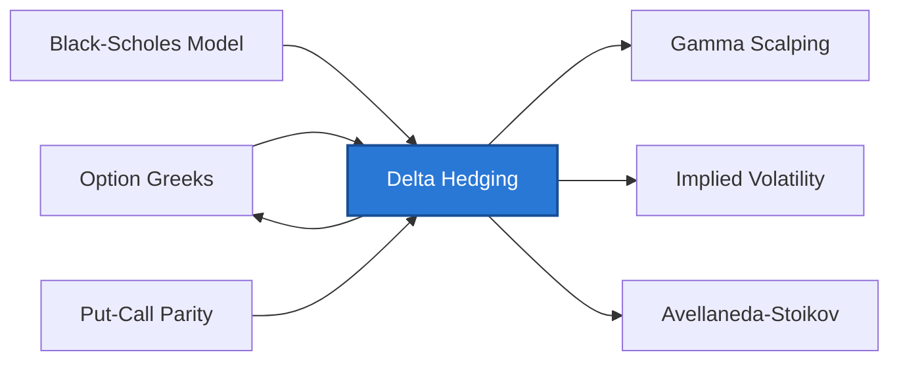

> [!info] Problem Chain
> **Chain:** Hedging & Risk → Gap 1: Holding an unhedged derivatives position is pure directional speculation
> **This concept:** Eliminates the primary (directional) source of risk by continuously holding −Δ shares per option, converting a directional bet into a pure volatility exposure.
> **Alternative approaches to this gap:** none — delta hedging is the unique first-order solution; [[Credit Default Swap]] addresses the analogous problem for credit risk
> **You need first:** [[Option Greeks]], [[Black-Scholes Model]], [[Put-Call Parity]]
> **This unlocks:** [[Option Greeks]] (gamma/theta trade-off emerges from hedging), [[Gamma Scalping]], [[Implied Volatility]], [[Avellaneda-Stoikov]]



## Why This Exists

**The gap:** When a bank or market maker sells an option, they take on the risk that the stock moves against them — potentially causing large, open-ended losses. Holding the option naked is essentially an undisclosed directional bet on the stock. Regulators, risk managers, and the traders themselves needed a systematic way to neutralize this exposure.

**What came before:** Traders either held options unhedged (taking full directional risk) or used static hedges like buying an offsetting option — which was expensive and didn't match the dynamic nature of option risk. There was no principle for how much of the underlying stock to hold.

**What this adds:** The delta — the first derivative of the option price with respect to the stock — gives the exact hedge ratio at every moment. Holding −Δ shares for every short option means small stock moves cancel in P&L. The key insight: once the directional risk is removed, what remains is purely exposure to volatility and time. This is why options desks think of themselves as running volatility books, not directional books. Delta hedging also provides the economic argument that *derives* the Black-Scholes PDE — by forcing the hedged portfolio to earn the risk-free rate.

**What it still doesn't solve:** Delta hedging leaves the position exposed to gamma risk (large moves), theta (time decay), vega (changes in implied vol), and practical issues like transaction costs from rebalancing. These residual risks are the subject of [[Option Greeks]] and more advanced hedging strategies.

## Math Concepts

**The delta-hedged portfolio** — short one call, long $\Delta$ shares:

$$\Pi = \Delta \cdot S - V$$

From [[Ito's Lemma]] applied to $V(S_t, t)$:

$$d\Pi = \Delta\,dS - dV = \Delta\,dS - \left(\Delta\,dS + \Theta\,dt + \frac{1}{2}\Gamma\,\sigma^2 S^2\,dt\right)$$

$$= -\Theta\,dt - \frac{1}{2}\Gamma\,\sigma^2 S^2\,dt$$

The $dS$ terms cancel — no stock risk remains. The portfolio is instantaneously riskless, so by no-arbitrage it must earn the risk-free rate:

$$d\Pi = r\Pi\,dt$$

This gives the BSM PDE — delta hedging is what *forces* the BSM pricing equation.

**P&L of a delta-hedged position:**

$$\text{Daily P&L} \approx \underbrace{\frac{1}{2}\Gamma (\Delta S)^2}_{\text{gamma P&L}} + \underbrace{\Theta \cdot \Delta t}_{\text{theta decay}}$$

- $\Gamma > 0$ (long option): profit from large moves, pay time decay
- $\Gamma < 0$ (short option): hurt by large moves, collect time decay

**The gamma–theta duality** is the fundamental trade-off in options:

| | Long option | Short option |
|-|-------------|--------------|
| Gamma | Positive | Negative |
| Theta | Negative (pay) | Positive (collect) |
| Wants | Large realized moves | Quiet market |

## Walkthrough

You sell a 1-month ATM call on a stock at $100, $\sigma=20\%$. BSM gives:
- Price: ~\$2.30
- $\Delta = 0.50$, $\Gamma = 0.028$, $\Theta = -\$0.056$/day

**Day 0:** sell call for \$2.30, buy 50 shares (= \$\Delta \times 100\$) for \$5000. Net position cost: $5000 − $230 = \$4770.

**Day 1:** stock moves to \$102 (+2%):
- Call value rises to ~\$3.36 (loss on short call: −\$1.06)
- 50 shares gained 50 × $2 = +$1.00
- Gamma P&L: $\frac{1}{2} \times 0.028 \times (2)^2 = +\$0.056$
- Net P&L ≈ −$1.06 + $1.00 + $0.056 ≈ −$0.004 ≈ \$0 (as expected for a delta-hedged position)
- The residual loss equals one day of $\Theta$ decay: $\Theta \approx -\$0.056$/day → net ≈ $0$ to first order

**Rebalance:** new $\Delta ≈ 0.61$ — buy 11 more shares to stay hedged.

This daily rebalancing is what makes BSM "work" in theory. In practice, it's costly (transaction costs, discrete rebalancing) and introduces hedging error.

## Analysis

- **Discrete rebalancing error:** perfect continuous hedging is impossible. Rebalancing daily or weekly leaves residual gamma exposure — the hedge leaks.
- **Volatility risk:** delta hedging eliminates *directional* risk but not *volatility* risk. If realized vol differs from implied vol used in pricing, the hedger profits or loses (see [[Gamma Scalping]]).
- **Model risk:** if the stock doesn't follow GBM (jumps, stochastic vol), delta calculated from BSM is wrong → hedging error.
- **Transaction costs:** every rebalance has a bid-ask cost. More frequent rebalancing reduces gamma exposure but increases costs. Optimal rebalance frequency is a real-world trade-off.

## Implementation

```python
import numpy as np
from scipy.stats import norm

def delta_hedge_simulation(S0=100, K=100, r=0.05, sigma=0.20,
                            T=30/252, n_steps=30, seed=42):
    """
    Simulate P&L of a delta-hedged short call over T years.
    Rebalance daily. Shows residual P&L from discrete hedging.
    """
    rng = np.random.default_rng(seed)
    dt = T / n_steps
    # Simulate stock path
    Z = rng.standard_normal(n_steps)
    log_ret = (r - 0.5 * sigma**2) * dt + sigma * np.sqrt(dt) * Z
    S = S0 * np.exp(np.concatenate([[0], np.cumsum(log_ret)]))

    def bsm_delta(S, t_remaining):
        if t_remaining <= 0:
            return 1.0 if S > K else 0.0
        d1 = (np.log(S/K) + (r + 0.5*sigma**2)*t_remaining) / (sigma*np.sqrt(t_remaining))
        return norm.cdf(d1)

    cash, shares = 0.0, 0.0
    for i in range(n_steps):
        t_rem = T - i * dt
        new_delta = bsm_delta(S[i], t_rem)
        trade = new_delta - shares          # shares to buy/sell
        cash -= trade * S[i]               # pay/receive cash
        shares = new_delta
        cash *= np.exp(r * dt)             # cash earns risk-free rate

    # Settlement: option payoff
    option_payoff = max(S[-1] - K, 0)
    final_pnl = cash + shares * S[-1] - option_payoff
    return final_pnl

pnl = [delta_hedge_simulation(seed=i) for i in range(500)]
print(f"Mean P&L: {np.mean(pnl):.4f}")    # Should be near 0
print(f"Std P&L:  {np.std(pnl):.4f}")     # Hedging error distribution
```

## Bridge to Quant / ML

- Delta hedging is the foundation of **derivatives trading** — every market maker in options runs a delta book continuously
- **RL for hedging:** framing delta hedging as an MDP (state = Greeks, action = rebalance amount, reward = −hedging error) is an active ML research area → [[60-ML-Finance/Reinforcement-Learning/Reinforcement Learning Trading]]
- **Transaction cost optimization:** ML models that learn optimal rebalancing frequency under realistic transaction costs outperform fixed-interval strategies

## Self-Assessment

---

### Level 1 — Conceptual

**Q1.** After delta hedging, a trader says their position is "really a bet on volatility." Explain what this means — what specifically does the hedged position make or lose money on?
<details>
<summary>Answer</summary>
Once directional risk is eliminated, the remaining P&L comes from two sources: gamma and theta. Gamma P&L = ½Γ(ΔS)² — this is positive for a long option (you profit from large stock moves) and negative for a short option. Theta P&L = Θ × Δt — this is negative for long options (you pay time decay). The net daily P&L is approximately ½Γ(ΔS)² + Θ. Whether you profit overall depends on whether the realized moves (actual volatility) are larger or smaller than what was baked into the option's price (implied volatility). If realized vol > implied vol, the gamma profits exceed the theta costs, and you profit from being long the option. This is the sense in which the hedged position is a bet on volatility.
</details>

**Q2.** Why does delta change as the stock moves, and what is the practical consequence for a hedger rebalancing daily instead of continuously?
<details>
<summary>Answer</summary>
Delta is a function of the stock price (via d1 in BSM). As the stock moves, d1 changes, and so does N(d1). For an ATM call, delta is about 0.5; as the stock rises, the call goes more in-the-money and delta rises toward 1; as the stock falls, delta falls toward 0. A hedger who rebalances only once per day is holding a delta that was correct at the start of the day but becomes wrong as the stock moves. The gap between the actual delta and the current hedge is an unhedged position — the "residual gamma exposure." Larger moves and higher gamma mean larger hedging errors. This is why discrete rebalancing (daily) introduces hedging error that shows up as P&L noise around zero.
</details>

**Q3.** Why does delta hedging *derive* the Black-Scholes PDE, rather than just being a consequence of it?
<details>
<summary>Answer</summary>
The logic runs: if you hold −Δ shares per option, the dS terms in the portfolio's P&L cancel exactly (by construction). The remaining terms involve only dt — the portfolio has no stochastic component. Since the portfolio is instantaneously riskless and holds no special information, it must earn exactly the risk-free rate by the no-arbitrage principle. Setting dΠ = rΠ dt and expanding using Ito's Lemma produces the BSM PDE. The PDE is not an assumption — it is the *forced consequence* of the hedging argument. Black-Scholes arrived at their formula by arguing that this riskless portfolio must exist and must earn r; the formula falls out of solving the resulting PDE.
</details>

---

### Level 2 — Quantitative

**Q4.** You sell a 3-month ATM call on a stock at S = 80, K = 80, r = 4%, σ = 25%. BSM gives Δ = 0.55, Γ = 0.032, Θ = −\$0.045/day. You delta-hedge by buying 55 shares (per 100-share option). The next day, the stock moves to S = 83. Compute: (a) gamma P&L, (b) theta P&L, (c) net P&L of the hedged position.
<details>
<summary>Answer</summary>
(a) Gamma P&L = ½ × Γ × (ΔS)² = ½ × 0.032 × (3)² = ½ × 0.032 × 9 = \$0.144 per option. For the short option position this is a loss: −\$0.144 × 100 = −\$14.40 (short gamma means large moves hurt).

(b) Theta P&L: as the short option seller, positive theta means you collect +\$0.045/day × 100 shares = +\$4.50.

(c) Net P&L = −$14.40 + $4.50 = −\$9.90. The \$3 move was large enough to more than offset the theta collection. The breakeven daily move is sqrt(2 × Θ/Γ) = sqrt(2 × 0.045 / 0.032) = sqrt(2.81) ≈ \$1.68.
</details>

**Q5.** The simulation code in this note runs 500 paths of a delta-hedged short call and reports mean and std P&L. If the simulation is run with realized vol at exactly the implied vol (σ = 0.20), the mean P&L should be near zero. What happens to mean P&L if the simulation is re-run with the stock process using σ_real = 0.30 while the delta is still computed using σ_BSM = 0.20? Explain the direction and approximate magnitude.
<details>
<summary>Answer</summary>
If realized vol (0.30) exceeds the implied vol used for delta calculation (0.20), the stock makes larger moves than the delta hedge was designed for. The hedger is short gamma (sold the call), and larger moves than expected cause net losses from gamma. The short option was priced using σ = 0.20 — the hedger collected a premium reflecting 20% vol. But the actual hedging costs (gamma × realized moves) are higher than expected. The mean P&L will be negative — approximately equal to −½ × Γ̄ × (σ²_real − σ²_BSM) × S² × T, which is the integral of the extra gamma cost over the life of the option. With σ_real = 0.30 vs σ_BSM = 0.20, the variance difference is 0.09 − 0.04 = 0.05, so the average loss is roughly the vega of the option times (0.30 − 0.20) = about \$2–\$3 per option for the parameters in this note.
</details>

---

### Level 3 — Coding

**Q6.** In `delta_hedge_simulation`, the cash account is updated each step with `cash *= np.exp(r * dt)`. What would happen to the final P&L if this line were removed, and why is earning interest on cash economically necessary for the hedge to be "fair"?
<details>
<summary>Answer</summary>
Removing `cash *= np.exp(r * dt)` means the cash account earns zero interest. This breaks the hedge in two ways: (1) When you sell the call and receive premium, that cash would not earn the risk-free rate, understating the hedger's income. (2) When you borrow cash to buy delta shares, you're not being charged the cost of borrowing. Both effects distort the P&L. The BSM argument explicitly assumes that all cash can be invested/borrowed at rate r — the no-arbitrage argument that derives the BSM PDE requires the riskless portfolio to earn exactly r. If cash earns 0 instead of r, the theoretical mean P&L shifts by approximately the risk-free return on the initial net cash position over the hedge period, which can easily be a few dollars per option.
</details>

---

### Common Misconceptions

| Misconception | Reality |
|---------------|---------|
| A delta-hedged position has no risk | It eliminates directional (first-order) risk but retains gamma risk (large moves), theta (time decay), vega (vol changes), and discrete rebalancing error |
| More frequent rebalancing is always better | More frequent rebalancing reduces gamma exposure but increases transaction costs from bid-ask spreads. Optimal frequency balances these two — it is not "hedge continuously" |
| The delta from BSM is the "correct" delta | BSM delta assumes constant vol. Under stochastic vol or with a vol smile, the correct hedge ratio differs. Using BSM delta when the smile is steep introduces systematic hedging error |
| Delta hedging makes the option seller risk-free | It eliminates stock direction risk. The seller still has volatility risk: if realized vol is higher than implied, the gamma losses exceed the premium collected |

## Related Concepts
- [[Option Greeks]] — $\Delta$ is what you hedge; $\Gamma$ is what makes it hard
- [[Black-Scholes Model]] — delta hedging is the argument that *derives* BSM
- [[Gamma Scalping]] — intentional exploitation of gamma P&L
- [[Implied Volatility]] — the vol baked into your delta calculation
- [[Avellaneda-Stoikov]] — extends hedging ideas to market making

## Sources Used
- Hull — *Options, Futures & Other Derivatives*, ch.19

---

## Revision Log

| Date | Change | Trigger |
|------|--------|---------|
| 2026-07-04 | Added Mermaid dependency diagram | Visual learning pilot |
| 2026-04-12 | Full content written | Hull ch.19 |
| 2026-04-11 | Fixed Day 1 walkthrough P&L breakdown: corrected gamma/theta offset to show net ≈ \$0 (not −\$0.07), consistent with stated $\Theta = -\$0.056$/day | QA review |
