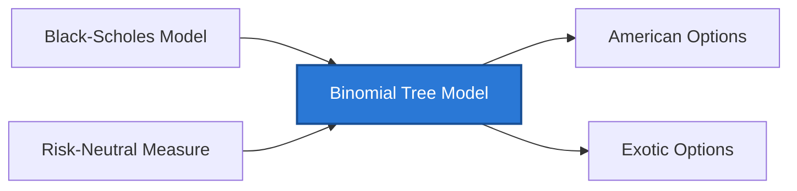

> [!info] Problem Chain
> **Chain:** Pricing → Gap 6: Many contracts have no closed-form solution
> **This concept:** A discrete-time lattice that prices options by backward induction; Solution C to Gap 6, uniquely suited to American early-exercise problems
> **Alternative approaches to this gap:** [[Numerical Methods PDE]] (Solution A — finite difference), [[Monte Carlo Methods]] (Solution B — simulation)
> **You need first:** [[Black-Scholes Model]], [[Risk-Neutral Measure]]
> **This unlocks:** [[American Options]], [[Exotic Options]]



## Why This Exists

**The gap:** Black-Scholes gives an elegant closed-form formula for European options, but it breaks down the moment you add any flexibility to the option — most importantly, the right to exercise early. American put options, which can be exercised at any time before expiry, have no closed-form solution. You need a method that can check, at every moment, whether it is better to exercise now or wait.

**What came before:** BSM and its direct extensions only price contracts with a single, fixed payoff at a specific future date. The continuous-time PDE approach can handle American options but requires a numerical grid solver that is not immediately intuitive to build or reason about.

**What this adds:** The binomial tree provides a discrete-time lattice of possible stock prices. At each node you can explicitly compare "exercise now" vs "continue holding" — which is exactly what American option valuation requires. You work backward from known terminal payoffs to today's price, applying no-arbitrage replication at each single step. Every pricing operation is transparent and auditable. As a bonus, the tree converges to BSM in the limit, proving that BSM can be derived from first principles without stochastic calculus.

**What it still doesn't solve:** For high accuracy (large N), the binomial tree requires O(N²) nodes and is slow compared to finite-difference PDE solvers or Monte Carlo for path-dependent payoffs. It does not naturally handle exotic path-dependent features like lookbacks or Asians. For those, Monte Carlo or PDE methods (Gaps 6 Solutions A and B) are better.

## Math Concepts

### One-Step Binomial Tree

Stock today: $S$. Over one period $\Delta t$, stock moves to:
- $Su$ with some probability (up factor $u > 1$)
- $Sd$ with some probability (down factor $d < 1$)

Option payoffs at expiry:
- $V_u$ if stock goes up
- $V_d$ if stock goes down

**Replication approach:** hold $\Delta$ shares + $B$ dollars in bonds. Solve for $\Delta$ and $B$:

$$\Delta \cdot Su + B e^{r\Delta t} = V_u$$
$$\Delta \cdot Sd + B e^{r\Delta t} = V_d$$

Solving:

$$\Delta = \frac{V_u - V_d}{Su - Sd} \quad \text{(the hedge ratio)}$$

$$B = e^{-r\Delta t} \cdot \frac{V_d \cdot u - V_u \cdot d}{u - d}$$

**Option price today:** $V = \Delta \cdot S + B$

**Risk-neutral probability:** substitute and simplify to get a cleaner formula. Define:

$$p = \frac{e^{r\Delta t} - d}{u - d}$$

This is the **risk-neutral probability** — the probability that makes the stock earn exactly the risk-free rate. It's not the real-world probability of going up. It's a mathematical convenience that lets us write:

$$V = e^{-r\Delta t} \left[ p \cdot V_u + (1-p) \cdot V_d \right]$$

*Interpretation:* the option price is the discounted expected payoff under the risk-neutral measure. Weight the up-payoff by $p$, the down-payoff by $(1-p)$, then discount at the risk-free rate.

### Multi-Step Tree

Build the tree forward (enumerate all stock prices), then work backward (compute option values):

**Forward pass** — stock price at node $(i, j)$ (step $i$, $j$ up-moves):

$$S_{i,j} = S_0 \cdot u^j \cdot d^{i-j}$$


*A 4-step recombining lattice ($S_0=100$, $u=1.15$). Nodes reached by the same number of up-moves land on the same price regardless of order — this recombination is what keeps the tree at $O(N^2)$ nodes instead of $O(2^N)$.*

**Backward pass** — for European options:

$$V_{i,j} = e^{-r\Delta t} \left[ p \cdot V_{i+1,j+1} + (1-p) \cdot V_{i+1,j} \right]$$

**American option modification:** at each interior node, take the *maximum* of continuation value and intrinsic value (early exercise value):

$$V_{i,j} = \max\!\left(\underbrace{e^{-r\Delta t}[p \cdot V_{i+1,j+1} + (1-p) \cdot V_{i+1,j}]}_{\text{continuation}},\; \underbrace{K - S_{i,j}}_{\text{exercise (put)}}\right)$$

### Cox-Ross-Rubinstein (CRR) Parameterization

The standard choice that ensures the tree converges to Black-Scholes as $N \to \infty$:

$$u = e^{\sigma\sqrt{\Delta t}}, \quad d = e^{-\sigma\sqrt{\Delta t}} = \frac{1}{u}, \quad \Delta t = \frac{T}{N}$$

Risk-neutral probability:

$$p = \frac{e^{r\Delta t} - d}{u - d}$$

As $N \to \infty$, $\Delta t \to 0$, and the binomial price converges to the Black-Scholes price.

### At-a-Glance Summary

| Quantity | Formula |
|----------|---------|
| Up factor (CRR) | $u = e^{\sigma\sqrt{\Delta t}}$ |
| Down factor (CRR) | $d = 1/u$ |
| Risk-neutral prob | $p = (e^{r\Delta t} - d)/(u - d)$ |
| Option value (European) | $V = e^{-r\Delta t}[p V_u + (1-p)V_d]$ |
| Option value (American) | $V = \max(\text{intrinsic}, \text{continuation})$ |

## Walkthrough

**Setup:** $S_0 = 100$, $K = 100$, $u = 1.1$, $d = 0.9$, $r = 5\%$, $T = 1$ year, 2 steps ($\Delta t = 0.5$).

**Step 1: Compute risk-neutral probability**

$$p = \frac{e^{0.05 \times 0.5} - 0.9}{1.1 - 0.9} = \frac{1.0253 - 0.9}{0.2} = \frac{0.1253}{0.2} = 0.6264$$

**Step 2: Build the stock price tree**

```
         S_uu = 121.0
        /
S_u = 110.0
      \      S_ud = 99.0
S = 100
      /      S_du = 99.0
S_d = 90.0
        \
         S_dd = 81.0
```

(Note: $S_{ud} = S_{du} = 100 \times 1.1 \times 0.9 = 99$ — the tree recombines.)

**Step 3: Terminal call payoffs** (for $K = 100$):

$$V_{uu} = \max(121 - 100, 0) = 21$$
$$V_{ud} = \max(99 - 100, 0) = 0$$
$$V_{dd} = \max(81 - 100, 0) = 0$$

**Step 4: Roll back one step**

$$V_u = e^{-0.05 \times 0.5} [0.6264 \times 21 + 0.3736 \times 0] = 0.9753 \times 13.154 = 12.825$$

$$V_d = e^{-0.05 \times 0.5} [0.6264 \times 0 + 0.3736 \times 0] = 0$$

**Step 5: Roll back to today**

$$V_0 = e^{-0.05 \times 0.5} [0.6264 \times 12.825 + 0.3736 \times 0] = 0.9753 \times 8.030 = 7.831$$

**Call price: \$7.83**

For an American put at the same strike, at each interior node we would also check whether exercising early (taking $K - S$) is worth more than continuing — the tree forces this comparison explicitly.

## Analysis

**Advantages over Black-Scholes:**

1. **Prices American options** — early exercise is checked at every node. No closed-form equivalent exists for American puts.
2. **Visually intuitive** — you can see every path, every node, every payoff. Makes the pricing logic transparent.
3. **Handles dividends easily** — reduce the stock price by the dividend on the ex-date node, continue tree normally.
4. **Handles path-dependent features** — barrier options, lookback options can be priced (with modifications).

**Disadvantages:**

1. **Slow for large N** — an $N$-step tree has $O(N^2)$ nodes. Pricing one option with $N = 1000$ steps requires millions of calculations. Monte Carlo or finite-difference methods are faster for high precision.
2. **Convergence oscillates** — the binomial price oscillates around the BSM price as $N$ increases (especially near the strike). Smooth convergence requires tricks (Richardson extrapolation, or averaging odd/even N).

**Convergence to BSM:** as $N \to \infty$ with CRR parameterization, the binomial price converges to the BSM price for European options. This proves BSM can be derived from simple no-arbitrage reasoning without stochastic calculus.

**Comparison table:**

| Feature | Binomial Tree | Black-Scholes |
|---------|--------------|--------------|
| European calls/puts | Yes (converges to BSM) | Yes (exact formula) |
| American options | Yes (natural) | No (no closed form for puts) |
| Speed | Slow (O(N^2)) | Instant |
| Intuition | High | Lower |
| Dividends | Easy | Requires adjustments |

## Implementation

```python
import numpy as np
from scipy.stats import norm
import matplotlib.pyplot as plt


def bsm_price(S, K, r, sigma, T, option_type="call"):
    """BSM closed-form price for European options."""
    d1 = (np.log(S / K) + (r + 0.5 * sigma**2) * T) / (sigma * np.sqrt(T))
    d2 = d1 - sigma * np.sqrt(T)
    if option_type == "call":
        return S * norm.cdf(d1) - K * np.exp(-r * T) * norm.cdf(d2)
    else:
        return K * np.exp(-r * T) * norm.cdf(-d2) - S * norm.cdf(-d1)


def binomial_tree(S, K, r, sigma, T, N, option_type="call", american=False):
    """
    Price a European or American option using the CRR binomial tree.

    Parameters
    ----------
    S, K, r, sigma, T : standard option parameters
    N : number of time steps
    option_type : "call" or "put"
    american : if True, allow early exercise at each node
    """
    dt = T / N
    u = np.exp(sigma * np.sqrt(dt))
    d = 1 / u
    p = (np.exp(r * dt) - d) / (u - d)
    discount = np.exp(-r * dt)

    # Build final stock prices (using recombining tree)
    # Node j at step N: S * u^j * d^(N-j) for j = 0, 1, ..., N
    j = np.arange(N + 1)
    S_T = S * (u ** j) * (d ** (N - j))

    # Terminal option payoffs
    if option_type == "call":
        V = np.maximum(S_T - K, 0.0)
    else:
        V = np.maximum(K - S_T, 0.0)

    # Backward induction
    for i in range(N - 1, -1, -1):
        # Stock prices at this step
        S_now = S * (u ** np.arange(i + 1)) * (d ** (i - np.arange(i + 1)))
        # Continuation value
        V = discount * (p * V[1:i+2] + (1 - p) * V[0:i+1])
        if american:
            # Intrinsic value
            if option_type == "call":
                intrinsic = np.maximum(S_now - K, 0.0)
            else:
                intrinsic = np.maximum(K - S_now, 0.0)
            V = np.maximum(V, intrinsic)

    return V[0]


# ── Example: 2-step tree walkthrough ──────────────────────────────────────────
S, K, r, T = 100, 100, 0.05, 1.0
u, d = 1.1, 0.9
dt = T / 2
p = (np.exp(r * dt) - d) / (u - d)
print(f"Risk-neutral p = {p:.4f}")
print(f"Call price (2-step, manual u/d): ~7.83")
print()

# ── European vs American put comparison ───────────────────────────────────────
sigma = 0.20
N = 100

eu_put = binomial_tree(S, K, r, sigma, T, N, "put", american=False)
am_put = binomial_tree(S, K, r, sigma, T, N, "put", american=True)
bsm_put = bsm_price(S, K, r, sigma, T, "put")

print(f"European put (binomial N={N}): {eu_put:.4f}")
print(f"European put (BSM):            {bsm_put:.4f}")
print(f"American put (binomial N={N}): {am_put:.4f}")
print(f"Early exercise premium:        {am_put - eu_put:.4f}")
print()

# ── Convergence to BSM as N increases ─────────────────────────────────────────
Ns = [2, 5, 10, 20, 50, 100, 200, 500]
eu_prices = [binomial_tree(S, K, r, sigma, T, n, "call") for n in Ns]
bsm_call = bsm_price(S, K, r, sigma, T, "call")

print("Convergence of European call to BSM:")
print(f"{'N':>6} {'Binomial':>12} {'BSM':>10} {'Error':>12}")
for n, price in zip(Ns, eu_prices):
    print(f"{n:>6} {price:>12.6f} {bsm_call:>10.6f} {price - bsm_call:>+12.6f}")

# ── Optional: plot convergence ─────────────────────────────────────────────────
# plt.figure(figsize=(8, 4))
# plt.semilogx(Ns, eu_prices, "o-", label="Binomial (European call)")
# plt.axhline(bsm_call, color="red", linestyle="--", label=f"BSM = {bsm_call:.4f}")
# plt.xlabel("Number of steps N")
# plt.ylabel("Option price")
# plt.title("Binomial Tree Convergence to BSM")
# plt.legend()
# plt.tight_layout()
# plt.savefig("binomial_convergence.png", dpi=150)
```

## Bridge to Quant / ML

- **American option pricing in production:** most vanilla American option pricing (equity options, listed options) uses binomial or trinomial trees — the tree is the industry standard, not a textbook curiosity
- **Lattice methods for exotics:** barrier options, Bermudan options, and convertible bonds are routinely priced on modified trees because the backward induction naturally handles path-dependent exercise decisions
- **Connection to dynamic programming:** the backward induction in a binomial tree is the Bellman equation in disguise — continuation value vs. immediate payoff is exactly the RL value function problem. Longstaff-Schwartz (LSM) is the Monte Carlo generalization of this idea.
- **Feature engineering:** the binomial tree structure (branching factor, risk-neutral probabilities, node values) can be used to create features for ML models that predict option prices or early exercise boundaries

## Self-Assessment

---

### Level 1 — Conceptual

**Q1.** Why does the binomial tree not require you to know the "real" probability of the stock going up? Where does that probability show up, and what replaces it?
<details>
<summary>Answer</summary>
You never need the real-world probability p* because the option price is determined by replication, not by expectation. In the one-step model, you solve for the unique portfolio (Δ shares + B in cash) that reproduces the option's payoff in both the up and down scenarios. That portfolio has a definite cost today, and by no-arbitrage, the option must have the same cost. The real probability p* never enters this calculation. What replaces it is the risk-neutral probability p = (e^{rΔt} − d)/(u − d), which is not a forecast about the future but a mathematical weight that makes the discounted stock price a martingale under Q. The risk-neutral probability is determined entirely by r, u, and d.
</details>

**Q2.** Why is the binomial tree particularly valuable for American options, while BSM cannot handle them?
<details>
<summary>Answer</summary>
At every interior node of the tree, you have the stock price at that moment and can compute the intrinsic value of exercising immediately. The backward induction step explicitly takes the maximum of the continuation value (discounted expected value of holding) and the intrinsic value (payoff from exercising now). This comparison is exactly what American option valuation requires — finding the optimal exercise boundary. BSM's continuous-time framework produces a closed-form only when there is a fixed exercise date (European). American options require solving a free-boundary PDE, which has no closed form for puts. The tree discretizes this naturally.
</details>

**Q3.** The binomial tree converges to Black-Scholes as N → ∞ with the CRR parameterization. What does this convergence prove, conceptually?
<details>
<summary>Answer</summary>
It proves that BSM pricing is not an artifact of continuous-time mathematics — it follows from the same no-arbitrage replication logic that works in the simplest possible discrete model. The BSM formula is the limiting case of repeated one-step replication as the time steps become infinitesimally small. This is important because it means BSM's conclusions (price = replication cost, μ cancels, only σ matters) are model-independent consequences of no-arbitrage, not assumptions about continuous trading. It also validates the CRR parameterization as the "correct" way to set u and d so that the tree's variance matches GBM variance in the limit.
</details>

---

### Level 2 — Quantitative

**Q4.** Use a 1-step binomial tree to price a European put. Parameters: S = 50, K = 52, u = 1.10, d = 0.90, r = 6%, T = 1 year (one step, so Δt = 1). Show all steps.
<details>
<summary>Answer</summary>

Step 1: Terminal stock prices.
- Up: S_u = 50 × 1.10 = 55
- Down: S_d = 50 × 0.90 = 45

Step 2: Terminal put payoffs.
- V_u = max(52 − 55, 0) = 0
- V_d = max(52 − 45, 0) = 7

Step 3: Risk-neutral probability.
p = (e^{0.06×1} − 0.90) / (1.10 − 0.90)
  = (1.0618 − 0.90) / 0.20
  = 0.1618 / 0.20
  = **0.809**

Step 4: Discount expected payoff.
V = e^{−0.06×1} × (0.809 × 0 + 0.191 × 7)
  = 0.9418 × (0 + 1.337)
  = 0.9418 × 1.337
  = **\$1.26**

The European put is worth \$1.26.
</details>

**Q5.** Using the same tree as Q4 but now pricing an **American put**, check whether early exercise is optimal. What is the American put price, and what is the early exercise premium?
<details>
<summary>Answer</summary>

For a 1-step tree, we check at t=0 whether exercising immediately beats holding.

Intrinsic value at t=0: max(52 − 50, 0) = **\$2.00**

Continuation value (European put from Q4): **\$1.26**

Since intrinsic value (\$2.00) > continuation value (\$1.26), early exercise is optimal at t=0.

**American put price = \$2.00**

**Early exercise premium = $2.00 − $1.26 = \$0.74**

This illustrates why American puts are worth more than European puts and cannot be priced by BSM's European formula. When the put is sufficiently in the money (as here, with S < K), the time value of the option can become negative and immediate exercise is preferable.
</details>

---

### Level 3 — Coding

**Q6.** In the `binomial_tree` function, the backward induction loop uses `V[1:i+2]` and `V[0:i+1]` to compute the continuation value. Why are these the correct slice indices? What would go wrong if you used `V[0:i+1]` and `V[1:i+2]` reversed?
<details>
<summary>Answer</summary>
At step i (counting backward from N), the array V has been progressively shortened — after k backward steps, V has N+1−k elements. At step i counting down from N-1, the current level has i+1 nodes. Node j at step i connects to node j+1 at step i+1 (up move) and node j at step i+1 (down move). In the array after the previous backward step, the "up" successor of node j is at index j+1 (hence V[1:i+2]) and the "down" successor is at index j (hence V[0:i+1]). If reversed, you would weight the down payoffs with p (the risk-neutral up probability) and the up payoffs with (1−p), inverting the pricing logic. The call would become a put and vice versa. The correct ordering is: higher index = up-move outcome (higher stock price).
</details>

---

### Common Misconceptions

| Misconception | Reality |
|---------------|---------|
| The risk-neutral probability p is the real probability of the stock going up | p is a mathematical artifact that makes discounted stock prices a martingale. It is determined purely by r, u, d — not by any forecast of where the stock will actually go. |
| More steps always gives a more accurate price | Due to oscillation in the binomial tree near the strike, prices oscillate as N increases (especially for American options). Richardson extrapolation or averaging even/odd N is needed for smooth convergence. |
| The binomial tree is a toy model — real desks use something else | American equity options (listed options, equity warrants, convertible bonds) are routinely priced using binomial or trinomial trees in production. It is the industry standard, not a classroom approximation. |
| American calls should be exercised early like American puts | For non-dividend-paying stocks, early exercise of an American call is never optimal — its value always equals the European call. Early exercise premium only matters for puts and for calls on dividend-paying stocks. |

## Related Concepts
- [[Black-Scholes Model]] — the binomial tree converges to BSM in the limit; both share risk-neutral pricing
- [[Risk-Neutral Measure]] — the risk-neutral probability $p$ in the tree is the discrete version of the risk-neutral measure
- [[American Options]] — the binomial tree is the primary pricing method for American options
- [[Option Greeks]] — Greeks can be computed from the tree by finite differencing nodes

## Sources Used
- Hull — *Options, Futures & Other Derivatives*, ch.13

---

## Revision Log
| Date | Change | Trigger |
|------|--------|---------|
| 2026-07-04 | Added Mermaid dependency diagram + recombining lattice figure | Visual learning pilot |
| 2026-04-18 | Full content written | Hull ch.13 |
| 2026-04-11 | QA review passed — walkthrough arithmetic verified, CRR convergence code correct | QA review |
| 2026-04-18 | Renamed "Implementation (Python)" → "Implementation" for section consistency | review |
